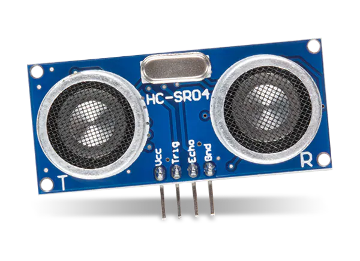
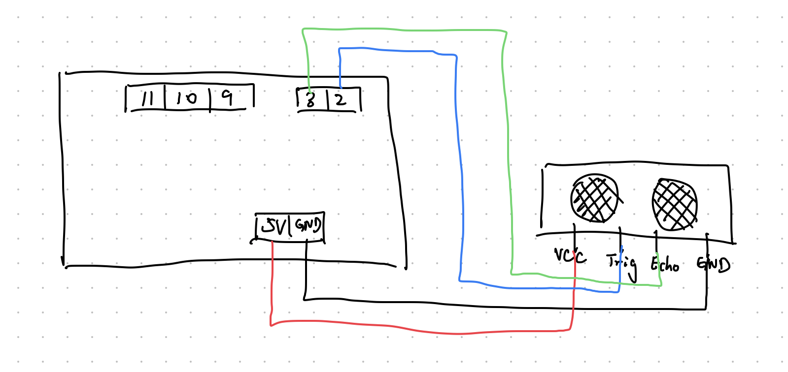
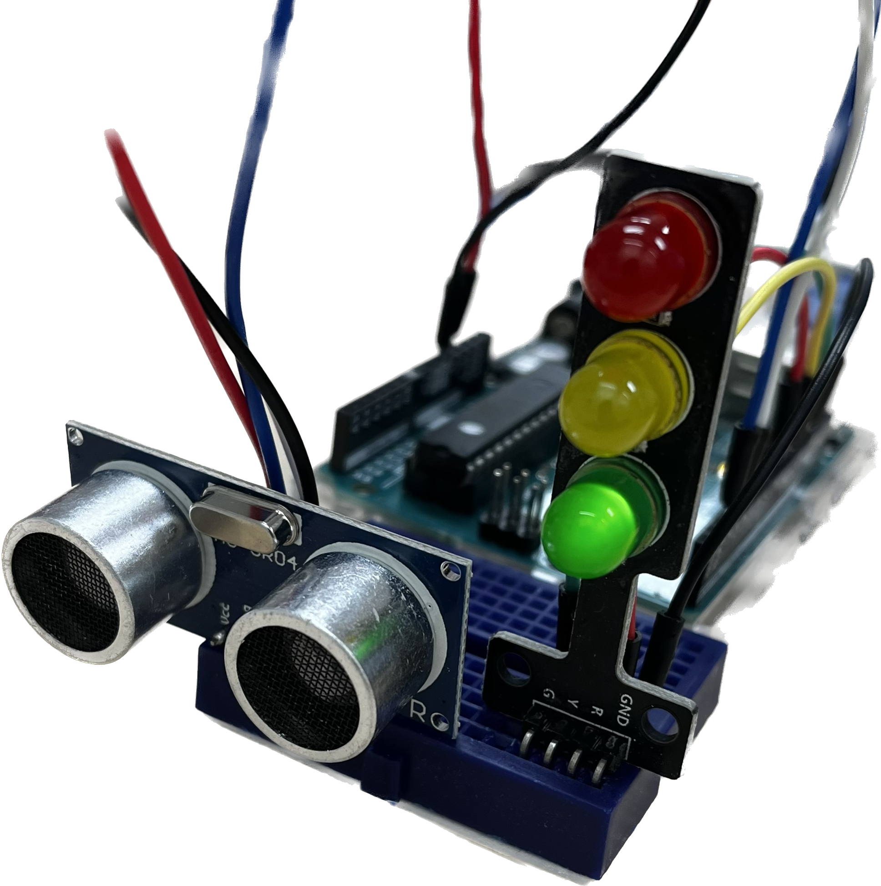
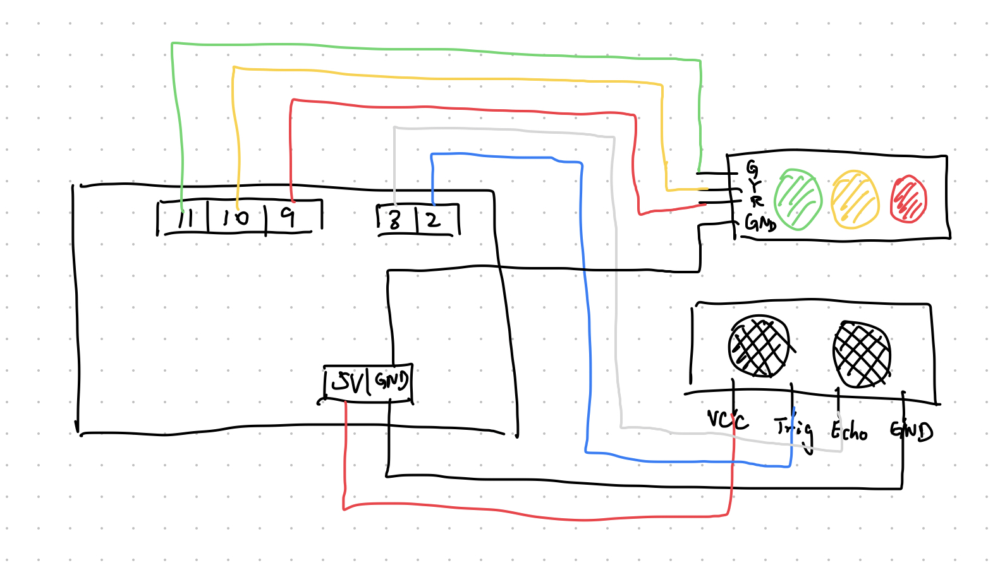

# 利用HC-SR04模块制作超声波测速仪

* HC-SR04是一种常用的超声波测距模块，用于测量物体与传感器之间的距离。它的测距范围是2cm到400cm。
* HC-SR04模块的工作原理是利用超声波传播的时间来测量距离。它由以下几个主要部分组成：
* 1. 发射器（Transmitter）： 发射器发出一个超声波脉冲信号。这个脉冲信号在空气中传播，然后遇到了目标物体。
* 2. 接收器（Receiver）： 接收器用于接收反射回来的超声波信号。当接收器接收到信号时，它会产生一个脉冲。
* 3. 控制电路： 控制电路负责控制发射器的脉冲信号，并计算发射与接收之间的时间差。通过测量时间差，可以计算出超声波传播的时间，从而得出物体与传感器之间的距离。
* 4. 触发器（Trigger）： 通过触发器信号，您可以启动一次测距操作。当触发器信号触发后，模块会发出一个超声波脉冲，然后等待接收到反射信号。
* 5. 回波脉冲（Echo Pulse）： 当接收器接收到反射回来的超声波信号时，会产生一个回波脉冲信号。

## 1. 测量距离并打印串口数据

### 电路连接图：

### 注意事项：
* 代码详见HC-SR04.ino
* delayMicroseconds(10) 表示暂停10微秒（10us）
* pulseIn(echo, HIGH, 25000) 表示测量从trig发射“高电平”信号到echo针脚接收“高电平”信号的时间，25000表示等待信号接收的时间，单位是微秒。超过此时间，系统判定未接收到信号，输出0
* 使用unsigned long 类型存储信号接收的时间 
* 模块发射超声波信号需要Arduino输出10微秒以上的高电平（HIGH）

## 2. 制作超声波测速仪的电路

### 电路连接图：

### 注意事项：
* 代码详见UltrasonicSpeedSensor.ino
* 注意设置trig, red, yellow, green的针脚为OUTPUT， echo为INPUT
* 测量速度需要取正数，使用abs()函数
* 根据速度大小判定亮哪种颜色的灯，一般正常为绿灯，超速为黄灯，违法为红灯

